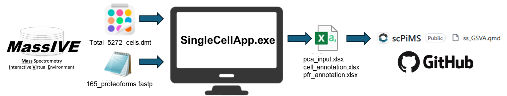
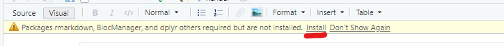
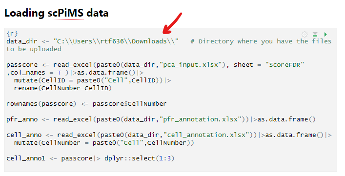
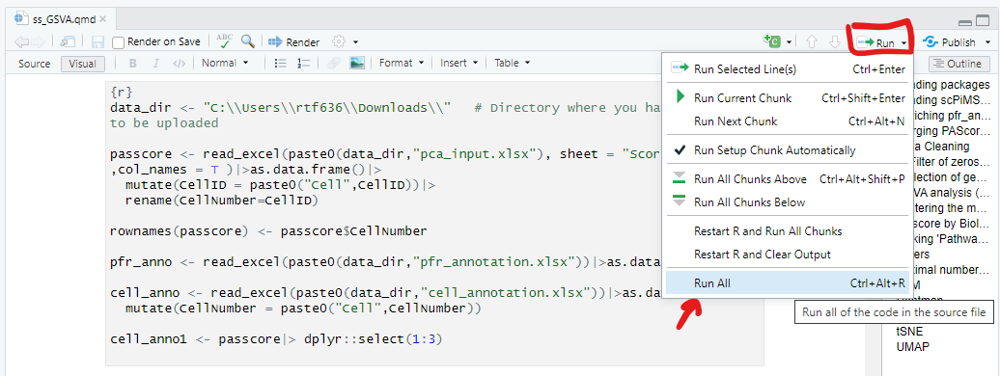
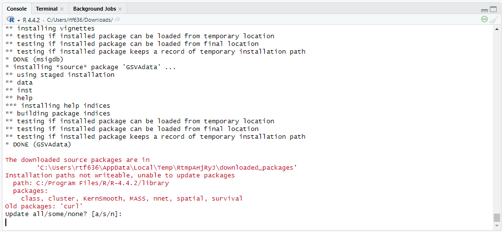

# scPiMS
Tools for the processing and analysis of single cell Proteoform imaging Mass Spectrometry (scPiMS)

### SingleCellApp.exe (.NET WPF application)
 - scores proteoforms against single cell ions

### scAnalyzer.m (MATLAB code)
 - optical single cell feature correlation
 - scPiMS single cell feature extraction for downstream I2MS processing

### GSVA_clusters_PCA/ss_GSVA.qmd (Quarto R Markdown)
 - pathway-adjusted PAScore based on single sample GSVA analysis
 - cluster analysis
 - Heatmap
 - PCA plots
 - tSNE plot
 - UMAP plot

# Installation Instructions

### System Requirements
Because the SingleCellApp.exe is a Windows Presentation Foundation (WPF) application that requires Windows 10 or later to run,
all validation and processing were performed on Windows 10 22H2.

### .NET Environment and SingleCellApp.exe
 - No additional installation (.NET Runtime 8.0 packaged directly into application)
 - The SingleCellApp.exe application is included in supplementary files in our publication located here: `IN SUBMISSION`

### MATLAB
 - MATLAB 2023b or later
 - Image Processing Toolbox
 - Statistics and Machine Learning Toolbox
 - Parallel Computing Toolbox
 - Installs in less than 10 minutes on standard workstation

 ### R Environment
 - R (v4.3.2+) and RStudio (2024.12.0+, Quarto v1.3.450)
	- https://posit.co/download/rstudio-desktop/ 
 - Installs in less than 10 minutes on standard workstation

# Running Demo Dataset

1. Download the 4 required demo files (Total_5272_cells.dmt, 165_proteoforms.fastp, pfr_annotation.xlsx, cell_annotation.xlsx) from MassIVE dataset [MSV000096472](https://massive.ucsd.edu/ProteoSAFe/dataset.jsp?task=1414496353314110b391a9356119ad5d)
1. Open the SingleCellApp.exe application and select the 2 input demo files (using the `Select Envelope File` button to pick the .fastp and the `Select Single Cell File` button to pick the .dmt)
1. Click the `Run Single Cell` button to process the demo dataset (should take approximately 30 minutes on a standard desktop)
1. Click the `Export score Matrix` button to save the processed data as an XLSX file in the directory with the other demo files (use the standard name pca_input.xlsx)
1. Use Excel to convert the "scores" worksheet in the XLSX file to a CSV file
1. Open the ss_GSVA.qmd R Markdown file using RStudio
1. Install the prerequisite R packages by clicking `Install` in RStudio

1. Scroll down to the `Loading scPiMS data` section and update the `data_dir` variable to point to the directory where you saved the demo files. Be sure to include slashes at the end of the path.

1. Run the QMD script by clicking the `Run` menu and selected the `Run All` option

1. RStudio will prompt you in the Console (tab on bottom left side) to install any packages. Type `a` and hit Enter to install.

1. The figures from the processing will be displayed directly in the script window

# Running other datasets
You can use the SingleCellApp.exe application to process other datasets by following the same steps as the demo dataset. The inputs are a .dmt file (containing single cell ion data) and a .fastp (containing the proteoform data).